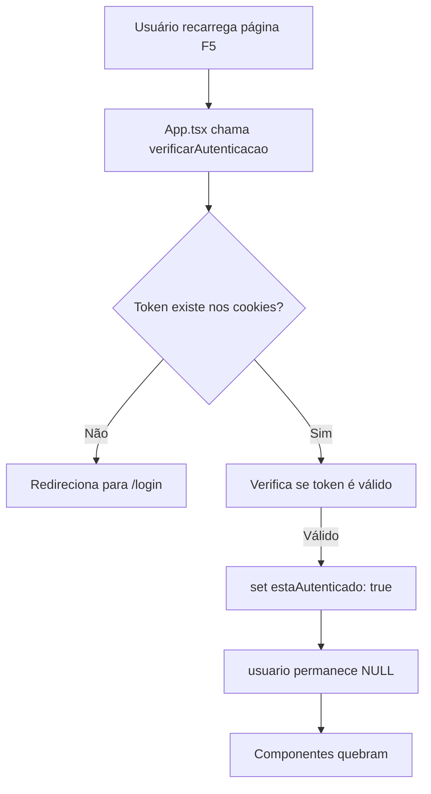

# Bug: Zustand Auth Store não Popula `usuario` Após Reload

## 📋 Resumo do Problema

Quando o usuário recarrega a página (F5), o sistema mantém a autenticação (token válido nos cookies), mas o objeto `usuario` no Zustand fica `null`, causando problemas em componentes que dependem de dados do usuário.

### Sintomas

- ✅ Token JWT válido nos cookies
- ✅ `estaAutenticado = true` no store
- ❌ `usuario = null` no store
- ❌ Componentes que usam `usuario?.id` ou `usuario?.nomeCompleto` falham

### Impacto

Componentes afetados incluem:
- **Chat de Contratos**: Não identifica quem enviou mensagens (todas aparecem como "usuario-anonimo")
- **Perfil do usuário**: Não mostra nome/email
- **Logs de auditoria**: Não registra corretamente quem fez ações
- Qualquer componente que use `const { usuario } = useAuthStore()`

---

## 🔍 Análise Técnica

### Localização do Bug

**Arquivo**: `src/lib/auth/auth-store.ts`
**Função**: `verificarAutenticacao()` (linha 446-501)

### O Problema

```typescript
// auth-store.ts:471-478
const resultado = await authService.verificarAcesso()

if (resultado.sucesso) {
  authLogger.info(
    { action: 'verificar-autenticacao', status: 'valid' },
    'Token de acesso válido',
  )
  set({ estaAutenticado: true, carregando: false })  // ❌ NÃO popula usuario!
}
```

A função `verificarAutenticacao()` **apenas atualiza** `estaAutenticado`, mas **não popula** o objeto `usuario`.

### Por Que Isso Acontece?

1. **No login inicial** (via `confirmarCodigo2FA`):
   ```typescript
   // auth-store.ts:153-158
   set({
     usuario,                    // ✅ Popula usuario
     estaAutenticado: true,
     carregando: false,
     erro: null,
   })
   ```

2. **Após reload da página** (via `verificarAutenticacao`):
   ```typescript
   // auth-store.ts:478
   set({ estaAutenticado: true, carregando: false })  // ❌ usuario fica null
   ```

### Fluxo Atual (Incorreto)



---

## ✅ Solução Proposta

### Opção 1: Corrigir `verificarAutenticacao()` (Recomendado)

**Arquivo**: `src/lib/auth/auth-store.ts`

```typescript
verificarAutenticacao: async () => {
  try {
    const token = cookieUtils.getCookie('auth_token')
    const refreshToken = cookieUtils.getCookie('auth_refresh_token')

    if (
      !token ||
      !refreshToken ||
      !validarTokenJWT(token) ||
      !validarTokenJWT(refreshToken)
    ) {
      authLogger.info(
        { action: 'verificar-autenticacao', status: 'no-cookies' },
        'Cookies de autenticação ausentes ou inválidos',
      )
      set({ carregando: false, estaAutenticado: false })
      return
    }

    // ✅ ADICIONAR: Extrair usuario do token
    const payload = getTokenInfo(token)

    if (!payload) {
      authLogger.error(
        { action: 'verificar-autenticacao', status: 'invalid-token' },
        'Não foi possível decodificar o token',
      )
      set({ carregando: false, estaAutenticado: false })
      return
    }

    // Mapear payload para Usuario
    const usuario: Usuario = {
      id: payload.usuarioId,
      email: payload.sub,
      nomeCompleto: payload.nomeCompleto,
      tipoUsuario: payload.tipoUsuario,
      precisaTrocarSenha: false,
      emailConfirmado: true,
      ativo: true,
    }

    authLogger.info(
      { action: 'verificar-autenticacao', status: 'checking' },
      'Verificando token de acesso',
    )

    const resultado = await authService.verificarAcesso()

    if (resultado.sucesso) {
      authLogger.info(
        { action: 'verificar-autenticacao', status: 'valid' },
        'Token de acesso válido',
      )

      // ✅ CORRIGIDO: Agora popula usuario também
      set({
        usuario,                    // ← ADICIONAR ISSO
        estaAutenticado: true,
        carregando: false
      })
    } else {
      // Tenta renovar o token
      authLogger.info(
        { action: 'verificar-autenticacao', status: 'expired' },
        'Token expirado, tentando renovar',
      )
      const renovado = await get().renovarToken()
      if (!renovado) {
        authLogger.warn(
          { action: 'verificar-autenticacao', status: 'renewal-failed' },
          'Falha na renovação, usuário será desconectado',
        )
        set({ estaAutenticado: false, carregando: false })
      }
    }
  } catch (erro) {
    authLogger.error(
      { action: 'verificar-autenticacao', status: 'error' },
      erro instanceof Error ? erro.message : 'Erro desconhecido na verificação',
    )
    set({ estaAutenticado: false, carregando: false })
  }
}
```

### Opção 2: Usar `getTokenInfo()` Diretamente nos Componentes

**Quando usar**: Se não quiser alterar o auth-store agora, pode usar como workaround.

```typescript
// Ao invés de:
const { usuario } = useAuthStore()
const userId = usuario?.id

// Usar:
import { getToken, getTokenInfo } from '@/lib/auth/auth'

const token = getToken()
const tokenInfo = token ? getTokenInfo(token) : null
const userId = tokenInfo?.usuarioId
const userName = tokenInfo?.nomeCompleto
```

**Exemplo Real**: `src/modules/Contratos/components/Timeline/contract-chat.tsx` (já implementado)

---

## 🎯 Comparação: Antes vs. Depois

### ❌ Antes (Bugado)

```typescript
// Estado após reload
{
  estaAutenticado: true,
  usuario: null,           // ← Problema!
  carregando: false,
  erro: null
}

// Componentes quebram
const { usuario } = useAuthStore()
const userId = usuario?.id ?? 'usuario-anonimo'  // ← Sempre fallback!
```

### ✅ Depois (Corrigido)

```typescript
// Estado após reload
{
  estaAutenticado: true,
  usuario: {               // ← Populado do token!
    id: "0198e663-9064-7149-a945-a82dbb24185e",
    email: "user@example.com",
    nomeCompleto: "Matheus Davi Felix Migliani França",
    tipoUsuario: "Administrador",
    precisaTrocarSenha: false,
    emailConfirmado: true,
    ativo: true
  },
  carregando: false,
  erro: null
}

// Componentes funcionam
const { usuario } = useAuthStore()
const userId = usuario?.id  // ← ID correto!
```

---

## 📦 Dependências

Para implementar a solução, você precisa:

```typescript
import { getTokenInfo } from '@/lib/auth/auth'
import type { Usuario } from '@/types/auth'
```

**Funções já existentes**:
- ✅ `getTokenInfo(token: string)` - Decodifica JWT (linha 102 de `auth.ts`)
- ✅ `getToken()` - Obtém token dos cookies (linha 27 de `auth.ts`)
- ✅ `validarTokenJWT(token: string)` - Valida formato (linha 20 de `auth.ts`)

---

## 🔧 Outros Lugares Afetados

### 1. Renovação de Token

**Arquivo**: `auth-store.ts:369-443`
**Status**: ✅ Já popula usuario corretamente

```typescript
// Linha 405-408
set({
  usuario,              // ✅ OK
  estaAutenticado: true,
})
```

### 2. Troca de Senha

**Arquivo**: `auth-store.ts:191-258`
**Status**: ✅ Já popula usuario corretamente

```typescript
// Linha 221-226
set({
  usuario,              // ✅ OK
  estaAutenticado: true,
  carregando: false,
  erro: null,
})
```

### 3. Confirmação 2FA

**Arquivo**: `auth-store.ts:101-188`
**Status**: ✅ Já popula usuario corretamente

```typescript
// Linha 153-158
set({
  usuario,              // ✅ OK
  estaAutenticado: true,
  carregando: false,
  erro: null,
})
```

---

## 🧪 Como Testar a Correção

### Teste Manual

1. **Login normal**:
   ```
   1. Faça login no sistema
   2. Verifique que usuario está populado
   3. Recarregue a página (F5)
   4. Verifique que usuario AINDA está populado
   ```

2. **Chat de contratos**:
   ```
   1. Faça login com usuário A
   2. Abra chat de um contrato
   3. Envie mensagem
   4. Verifique payload no DevTools: autorId deve ser GUID real
   5. Recarregue página
   6. Envie outra mensagem
   7. Verifique que autorId continua sendo GUID (não "usuario-anonimo")
   ```

3. **Console do navegador**:
   ```javascript
   // No console do navegador
   const token = document.cookie.split(';').find(c => c.includes('auth_token'))
   console.log('Token existe:', !!token)

   // Verificar store Zustand
   // (acessível se tiver DevTools do Zustand)
   ```

### Teste Automatizado (Futuro)

```typescript
// __tests__/auth-store.test.ts
describe('verificarAutenticacao', () => {
  it('deve popular usuario do token após reload', async () => {
    // Mock cookies com token válido
    mockCookies({
      auth_token: 'valid.jwt.token',
      auth_refresh_token: 'valid.refresh.token'
    })

    const { result } = renderHook(() => useAuthStore())

    await act(async () => {
      await result.current.verificarAutenticacao()
    })

    expect(result.current.estaAutenticado).toBe(true)
    expect(result.current.usuario).not.toBeNull()
    expect(result.current.usuario?.id).toBe('expected-user-id')
  })
})
```

---

## 📊 Payload do Token JWT (Referência)

```json
{
  "sub": "matheusmigliani.smsrio@gmail.com",
  "usuarioId": "0198e663-9064-7149-a945-a82dbb24185e",
  "nomeCompleto": "Matheus Davi Felix Migliani França",
  "cpf": "16165094732",
  "permissaoId": "2",
  "exp": 1760541296,
  "iss": "egestao-micro-auth-api",
  "aud": "egestao-frontend"
}
```

### Mapeamento para Usuario

| Campo JWT | Campo Usuario | Transformação |
|-----------|---------------|---------------|
| `usuarioId` | `id` | Direto |
| `sub` | `email` | Direto |
| `nomeCompleto` | `nomeCompleto` | Direto |
| `tipoUsuario` | `tipoUsuario` | Direto |
| - | `precisaTrocarSenha` | Sempre `false` (já autenticado) |
| - | `emailConfirmado` | Sempre `true` (já autenticado) |
| - | `ativo` | Sempre `true` (já autenticado) |

---

## 🚀 Próximos Passos

1. [ ] Implementar correção na função `verificarAutenticacao()`
2. [ ] Testar em diferentes cenários (login, reload, renovação)
3. [ ] Remover workarounds dos componentes (se aplicável)
4. [ ] Adicionar testes automatizados
5. [ ] Documentar no CHANGELOG

---

## 📚 Referências

- **Arquivo principal**: `src/lib/auth/auth-store.ts`
- **Funções auxiliares**: `src/lib/auth/auth.ts`
- **Tipos**: `src/types/auth.ts`
- **Exemplo de uso correto**: `src/modules/Contratos/components/Timeline/contract-chat.tsx`

---

**Data**: 2025-10-15
**Autor**: Claude Code
**Status**: 🔴 Bug Ativo | 🟡 Workaround Implementado | 🟢 Aguardando Correção Definitiva
